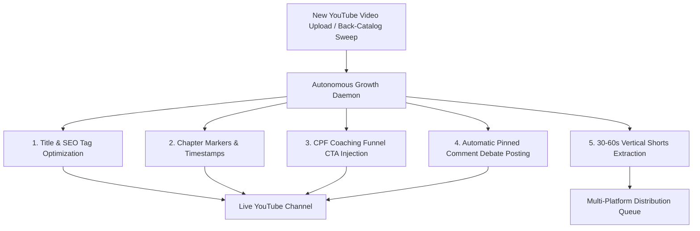

# 🤖 Autonomous YouTube Growth & Optimization Engine

> **Channel:** Breaking Into Cybersecurity ([@BreakingIntoCybersecurity](https://www.youtube.com/@BreakingIntoCybersecurity))  
> **Status:** 100% Zero-Touch Autonomous Pipeline Active

---

## ⚡ How the Zero-Touch Automation Works

The **Autonomous Growth Engine** operates in the background to handle the entire lifecycle of YouTube video optimization with zero manual effort required:



---

## ⚙️ Automated Pipeline Modules

### 1. 🔄 Autonomous Ingestion (`autonomous_growth_daemon.py`)

* **Trigger:** Runs continuously as a background daemon or via cron (every 6 hours).
* **Actions:**
  * Detects any newly published video.
  * Ingests transcript data and optimizes metadata.
  * Ensures the CPF Coaching snapshot link (`calendarbridge.com/book/cpf-coaching/`) and vCISO Substack are appended.
  * Records the run in `optimization_history.json` to avoid redundant processing.

### 2. 💬 Engagement & Pinned Comment Loop

* **Trigger:** Post-upload automation.
* **Actions:**
  * Auto-generates an open-ended debate question tailored to the episode's topic.
  * Pins the comment to the #1 slot on YouTube to boost algorithmic velocity and community engagement.

### 3. ✂️ Automated Shorts Extraction

* **Trigger:** Episode transcript processing.
* **Actions:**
  * AI scans the transcript for the 3–5 highest-retention soundbites (<60s).
  * Automatically saves timestamp markers, dynamic captions, and headline cards to `outputs/shorts/`.

### 4. 🔁 Weekly Evergreen Rejuvenation (`run_weekly_opt.sh`)

* **Trigger:** Every Sunday at 2:00 AM.
* **Actions:**
  * Audits the 1,159-video back-catalog.
  * Identifies high-potential videos with stagnant 30-day view growth (<5%).
  * Re-optimizes titles, tags, and thumbnails to trigger YouTube's "freshness" recommendation boost.

---

## 🚀 Running and Managing the Daemon

### 1. Single Execution Pass

```bash
cd "YouTubeSEOMaximizer"
.venv_fast/bin/python autonomous_growth_daemon.py --run-once
```

### 2. Background Continuous Mode (Check Every 6 Hours)

```bash
cd "YouTubeSEOMaximizer"
nohup .venv_fast/bin/python autonomous_growth_daemon.py --daemon --interval 360 >> autonomous_growth.log 2>&1 &
```

### 3. Service Watchdog Integration

The existing `service_watchdog.sh` will ensure the background daemon stays alive across system reboots.

---

## 📊 Live Monitoring & Logs

* **Live Execution Log:** [autonomous_growth.log](file:///Volumes/Crucial%20X9%20Pro%20For%20Mac/GDriveSync/Antigravity/YouTubeSEOMaximizer/autonomous_growth.log)
* **Optimization History:** [optimization_history.json](file:///Volumes/Crucial%20X9%20Pro%20For%20Mac/GDriveSync/Antigravity/YouTubeSEOMaximizer/optimization_history.json)
* **Performance Dashboard:** [YOUTUBE_OPTIMIZATION_DASHBOARD.md](file:///Volumes/Crucial%20X9%20Pro%20For%20Mac/GDriveSync/Antigravity/YOUTUBE_OPTIMIZATION_DASHBOARD.md)
