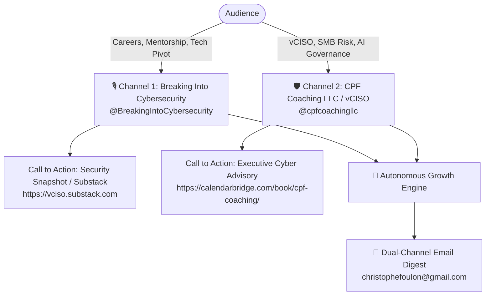

# 📊 Dual-Channel YouTube & vCISO Growth Dashboard

This dashboard tracks **Breaking Into Cybersecurity** and **CPF Coaching / vCISO** as completely distinct channel assets with dedicated performance baselines, content strategies, conversion funnels, and autonomous growth tracks.

---

## 🏛️ Channel Profiles & Architecture



---

## 📈 Real-Time Baseline Comparison

| Channel Attribute | 🎙️ Breaking Into Cybersecurity | 🛡️ CPF Coaching / vCISO |
| :--- | :--- | :--- |
| **Channel ID** | `UCM3YAEDu6W7JmQc0kb-CNtw` | `UCzqnKKt83CcvrH4ZSxD5hKA` |
| **YouTube Handle** | [`@BreakingIntoCybersecurity`](https://www.youtube.com/@BreakingIntoCybersecurity) | [`@cpfcoachingllc`](https://www.youtube.com/@cpfcoachingllc) |
| **Subscribers** | **2,030** | **39** |
| **Lifetime Views** | **71,810** | **7,485** |
| **Catalog Videos** | **1,144** (1,159 indexed) | **316** |
| **Core Target Audience** | Aspiring analysts, engineers, career switchers, hiring managers | Business owners, SMB executives, founders, CISOs |
| **Primary Conversion Funnel** | Substack & Community Mentorship | Fractional CISO Retainers & Risk Advisory |
| **History File** | [`history_bic.json`](file:///Volumes/Crucial%20X9%20Pro%20For%20Mac/GDriveSync/Antigravity/YouTubeSEOMaximizer/history_bic.json) | [`history_cpf_coaching.json`](file:///Volumes/Crucial%20X9%20Pro%20For%20Mac/GDriveSync/Antigravity/YouTubeSEOMaximizer/history_cpf_coaching.json) |

---

## 🎯 Channel 1: Breaking Into Cybersecurity (Strategy)

* **Mission:** Maximize organic search discovery and watch time around cybersecurity career progression, certifications, and leadership stories.
* **Autonomous Tracks:**
  1. **Top 20 Crown Jewels Refresh:** High-CTR titles + search intent metadata for high-traffic assets (e.g. *Blackhat Advice*, *Jason Dion Interview*).
  2. **Vertical Shorts:** Extracts 5 high-impact clips (<60s) from long-form interviews with dynamic on-screen hooks.
  3. **Series Playlists:** Automatically categorized into *Leadership Edition* (`PL2Td9LH7jZlArKfW_j4VF8khJUaj-YXYc`), *CISOThursdays* (`PL2Td9LH7jZlAyTXilJu-2nixrFJV9TxwL`), and *Special Editions*.
  4. **Community Debates:** Weekly career and certification trivia prompts.

---

## 🛡️ Channel 2: CPF Coaching / vCISO (Strategy)

* **Mission:** Position Christophe Foulon as the premier Fractional CISO / Cybersecurity Advisor for Northern Virginia and remote growth-stage SMBs.
* **Autonomous Tracks:**
  1. **Executive Risk Briefings:** Focuses on actionable SMB risk signals (e.g., *Patching Edge Routers*, *Broker Data Audits*, *AI Agent Ownership*).
  2. **High-Value Executive CTA:** Direct bookings for the **30-Minute Security Snapshot Call** via `calendarbridge.com/book/cpf-coaching/`.
  3. **Micro-Advisory Shorts:** Fast 45-second executive risk briefings designed for LinkedIn and YouTube Shorts syndication.
  4. **Cross-Linking to Substack:** Funneling viewers to [`vciso.substack.com`](https://vciso.substack.com).

---

## 📬 Automated Dual-Channel Email Delivery

Every automated execution cycle (and every 6 hours via the background daemon) sends an email to **`christophefoulon@gmail.com`** formatted as:

```text
===================================================================
      MULTI-CHANNEL YOUTUBE & vCISO AUTOMATION REPORT
===================================================================

🎙️ CHANNEL 1: BREAKING INTO CYBERSECURITY (@BreakingIntoCybersecurity)
• Subscribers: 2,030 | Lifetime Views: 71,810 | Videos: 1,144
• Series Playlists: 3 mapped (Leadership, CISO, Main)
• Shorts Queue: 2 vertical clips extracted

🛡️ CHANNEL 2: CPF COACHING LLC / vCISO (@cpfcoachingllc)
• Subscribers: 39 | Lifetime Views: 7,485 | Videos: 316
• Focus: SMB Risk Signals, AI Governance & vCISO Advisory
• CTAs: Executive Advisory Link Active

🤝 GUEST AMPLIFICATION & COMMUNITY ENGAGEMENT
• Guest 1-Click Social Kits: 4 ready
• Community Discussion Polls: 4 ready

⚠️ BLOCKERS & FAILURE BACKLOG: 0 Blockers
===================================================================
```
