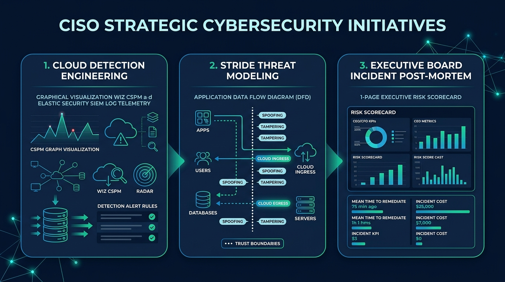

# The vCISO Brief #49: The 72-Hour TPRM & Cloud Blast-Radius Triage
### *An actionable 3-step blueprint for CISOs to audit high-risk cloud vendors using Wiz & Elastic, enforce contract clawbacks, and present defensible risk metrics to the Board.*
**By Christophe Foulon, CISSP, CRISC** • *vCISO Advisory & Cyber Risk Strategist* • *August 23, 2026*

---



---

## 🏛️ The Boardroom Reality: Why 90% of Vendor Risk Assessments Are Security Theater

If your Third-Party Risk Management (TPRM) program relies on sending annual 200-question SIG or CAIQ spreadsheets that vendors check off with zero verification, **you do not have a vendor risk program—you have a paper trail for liability.**

Last week, two major mid-market SaaS providers suffered upstream credential compromises. In both cases, the breached organizations had 'passed' their clients' annual security questionnaires with flying colors less than 90 days prior.

When a critical cloud vendor goes dark or leaks customer records, the Audit Committee will not ask: *"Did they fill out our questionnaire?"*  
They will ask: **“What data did they have, what was our blast radius, and why weren't their access tokens revoked within 60 minutes?”**

Here is the exact **3-Step Tactical Triage** I implement with executive security teams to turn static vendor risk into active, defensible controls using modern cloud detection and posture tooling.

---

## 🛠️ The Tactical CISO Playbook: Execute Steps A ➔ C

```
[ Step A: Map Cloud Blast Radius ] ──▶ [ Step B: Enforce Contractual Controls ] ──▶ [ Step C: Board Defensibility ]
 (Wiz Graph & Elastic SIEM Egress)       (Continuous IdP Revocation & DPA)            (1-Slide Audit Metric)
```

---

### 🔹 STEP A: Map the True Blast Radius (Do This Within 48 Hours)

Stop treating all 140 vendors equally. Tier them strictly by **Direct Cloud Data Access** and **Identity Integration**:

1. **Audit Cloud Identity & Toxic Combinations via Wiz:**
   * Query your **Wiz Cloud Security Graph** for third-party IAM roles or service accounts granted broad cross-account assume-role permissions (`sts:AssumeRole`) connected to sensitive S3 buckets or production databases.
   * *The Action:* Immediately eliminate unused third-party IAM cross-account permissions and enforce least-privilege scoping.
2. **Execute Egress & OAuth Data Flow Mapping in Elastic Security / Wazuh:**
   * In **Elastic Security SIEM**, inspect egress network telemetry and NetFlow logs for external SaaS endpoints receiving >50MB/week.
   * Query your Identity Provider (Okta / Microsoft Entra ID) logs for third-party OAuth apps granted tenant-wide permissions (`Files.ReadWrite.All`, `Directory.Read.All`). Revoke unauthorized tokens immediately.
3. **Establish Tier 1 Kill-Switch Isolation:**
   * Identify the 5 vendors whose compromise would paralyze operations (e.g., Cloud Hosting, Billing/Stripe, Customer CRM/Salesforce, Code Repo/GitHub, HRIS/Workday).
   * Verify whether emergency API token rotation takes **< 15 minutes** or requires opening a multi-day support ticket.

---

### 🔹 STEP B: Enforce Active Governance & Contractual Guardrails

Move from passive trust to automated verification:

1. **Mandate SSO & Conditional Access with Phishing-Resistant MFA:**
   * Never allow vendor accounts to log in with shared username/passwords. 
   * Enforce FIDO2 WebAuthn or device-managed certificates via your central IdP, with automated 24-hour deprovisioning on role termination.
2. **Implement the 24-Hour Breach Notification Clause:**
   * In every Master Services Agreement (MSA) and DPA renewal, insert an explicit obligation requiring vendor notification of any confirmed security incident within **24 hours**—backed by a **15% contract fee clawback** for non-compliance.
3. **Continuous SIEM Posture Monitoring Over Annual Audits:**
   * Ingest external attack surface telemetry and vendor vulnerability alerts into Elastic Security to trigger an internal security review if a critical partner drops below your baseline threshold.

---

### 🔹 STEP C: Present Defensible Metrics to the Board / Audit Committee

Do not show the Board a 30-page vendor list. Present this **single executive scorecard tile**:

| Metric | Target SLA | Current Posture | Operational Risk Status |
| :--- | :--- | :--- | :--- |
| **Tier-1 Vendors with Phishing-Resistant SSO** | 100% | 94% | 🟢 **Controlled** (2 legacy vendors migrating) |
| **Average Blast-Radius Revocation Time** | < 30 Mins | 18 Mins | 🟢 **Defensible** (Tested quarterly) |
| **Wiz Toxic Combinations & Unused IAM Cross-Roles** | 0 | 0 | 🟢 **Zero High-Risk Exposure** |
| **Critical Vendors with Missing DPAs** | 0 | 0 | 🟢 **100% Contractual Compliance** |

> **Executive Rule of Thumb:** If you cannot produce this table during an active incident, your cyber insurance carrier and board will treat the breach as systemic negligence.

---

## 🎯 The 3-Project Strategic Framework (For Teams & Up-and-Coming Security Leaders)

If your internal team or engineers are looking to demonstrate proof of work to executive leadership:

1. **🧪 Cloud Detection Engineering:** Build automated attack-path detection rules in **Wiz** and **Elastic Security / Wazuh** to spot anomalous privilege escalation.
2. **🛡️ STRIDE Threat Modeling:** Map application data flows, cloud ingress/egress, and trust boundaries before code hits production.
3. **📄 Executive Incident Post-Mortem:** Deliver a 1-page financial and risk impact brief that the CEO and CFO can understand in under 2 minutes.

---

## 🎙️ Executive Soundbite of the Week

### 🎧 From the CISO Trenches: Tammy Klotz on Pragmatic Third-Party Risk
> *“Vendor risk isn't about eliminating third parties—it's about understanding the exact boundary where your infrastructure ends and their risk begins, then building continuous tripwires at that seam.”*

* 📺 **Watch the Video Case Study:** [Breaking Into Cybersecurity YouTube](https://www.youtube.com/@BreakingIntoCybersecurity)
* 🎧 **Listen to the Executive Deep Dive:** [Breaking Into Cybersecurity on Spotify](https://podcasters.spotify.com/pod/show/breaking-into-cybersecuri)

---

## 🛡️ Strategic Advisory & Boardroom Action

If you are a CISO, VP of Engineering, or CEO looking to:
1. Conduct an independent **Vendor Risk & Cloud Blast-Radius Architecture Review**
2. Build an audit-defensible **Board Cyber Risk Dashboard**
3. Implement **Fractional CISO Governance** without the $350k+ full-time executive overhead

👉 **[Schedule a 30-Minute Executive Advisory Session with Christophe Foulon](https://calendarbridge.com/book/cpf-coaching/)**

---

*Delivered weekly to over 2,000 security executives and leaders. If this issue provided clear ROI, forward it to your security team.*

**Christophe Foulon, CISSP, CRISC**  
*Fractional CISO | Cybersecurity Executive Advisor | Host, Breaking Into Cybersecurity*  
[Connect on LinkedIn](https://www.linkedin.com/in/christophefoulon/) • [Substack Archive](https://vciso.substack.com)
