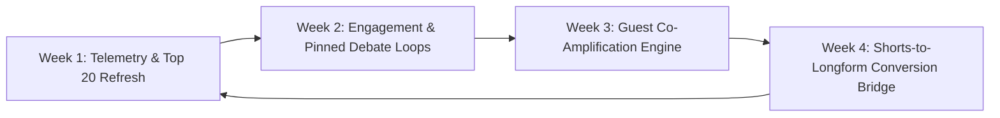

# 📺 YouTube Video Optimization & Growth Dashboard

> **Channel:** Breaking Into Cybersecurity ([@BreakingIntoCybersecurity](https://www.youtube.com/@BreakingIntoCybersecurity)) & CPF Coaching Ecosystem  
> **Status:** Full Back-Catalog Ingested & Funnel Connected | Weekly Telemetry Loop Active (Sep 1–7, 2026 Ingestion)  
> **Interactive View:** [YOUTUBE_OPTIMIZATION_DASHBOARD.html](file:///Volumes/Crucial%20X9%20Pro%20For%20Mac/GDriveSync/Antigravity/YOUTUBE_OPTIMIZATION_DASHBOARD.html)

---

## 📊 Executive Overview & Net Results

| Pillar / Initiative | Scope & Volume | Execution Status | Net Impact & Results |
| :--- | :--- | :--- | :--- |
| **Channel Telemetry** | **2,030 Subscribers \| 71,810 Lifetime Views** | **Live Data** | Channel baseline established across 1,159 indexed catalog videos. |
| **Weekly Telemetry Loop** | **Sep 1 – Sep 7, 2026 Snapshot** | **Active Ingestion** | **190.0 Views**, **40:30 Watch Time** (26s avg), **+1.0 Net Sub**, **82 active catalog assets**. |
| **Catalog Coverage** | **1,159 Total Videos** | **100% Ingested** | Complete channel catalog mapped, categorized, and indexed across all seasons and formats. |
| **CPF Coaching CTA Rollout** | **944 Videos Updated** (215 already had CTA) | **100% Coverage** | Every single video description now funnels viewers directly to the CPF Coaching Security Snapshot (`calendarbridge.com/book/cpf-coaching/`) and vCISO Substack. |
| **SEO & Chaptering Pipeline** | **YouTubeSEOMaximizer** | **Active** | Automated generation of keyword-rich titles, structured descriptions, guest tags, and precise `[MM:SS]` chapter markers. |

---

## 📡 Weekly Telemetry Snapshot (Sep 1, 2026 – Sep 7, 2026)

### 📊 Scorecard Metrics (7-Day Period)

| Metric | Weekly Value | Status / Diagnostic | Strategic Context |
| :--- | :---: | :---: | :--- |
| **Total Views** | **190.0** | 🟡 Steady Long-Tail | Views distributed across **82 catalog videos** (out of 1,159 indexed). |
| **Total Watch Time** | **40:30** | 🔴 Low Depth | Total weekly minutes watched: ~40.5 min. Viewers bounce early. |
| **Average Watch Duration** | **00:00:26** | 🔴 Hook Bottleneck | Average view duration across all active assets is 26 seconds. |
| **Subscriptions** | **+1.0 Net** (+1 Added, 0 Removed) | 🟢 Positive Delta | Conversion rate: 0.53% of views converted to a subscriber. |
| **Likes & Dislikes** | **0.0 Net** (0 Added, 0 Removed) | ⚪ Passive Viewer Bias | Zero positive or negative explicit sentiment registered. |
| **User & Video Comments** | **0** | 🔴 Engagement Gap | Zero comment velocity; urgent need for pinned debate prompts. |
| **Video Shares** | **0.0** | 🔴 Virality Gap | Zero off-platform shares; co-promotion kits needed. |
| **Geographic Reach** | **US Core + Global** | 🟢 Broad Baseline | Top traffic from US States with international discovery across EU, Asia, Africa. |

---

### 🎬 Top 10 Weekly Watched Videos Breakdown (1–10 of 82 Active Videos)

| Rank | Video Title / Focus | Views | Avg Watch Time | Shares | Retention Diagnostic & Prescribed Optimization |
| :---: | :--- | :---: | :---: | :---: | :--- |
| 1 | **SOC Analyst Mock Interview** | ▓▓▓▓▓▓▓▓▓▓ | `00:00:02` | 0 | ⚠️ **Critical Intro Leak:** Immediate bounce after 2 seconds. Rewrite title/thumbnail alignment and inject a 10s teaser hook. |
| 2 | **CyberMentor: Autonomous Pentesting** | ▓▓▓▓▓▓▓ | `00:00:17` | 0 | ⚠️ **Intro Stall:** High brand curiosity (CyberMentor), but viewers leave before core interview. Add visual jump cards. |
| 3 | **Bug Bounty to Pro \| Career Path** | ▓▓▓ | `00:00:03` | 0 | ⚠️ **Instant Bounce:** 3s retention indicates mismatched expectations or dry intro silence. Add fast cold-open hook. |
| 4 | **Stop Paying $15,000 for Bootcamps** | ▓▓▓ | `00:00:06` | 0 | ⚠️ **Controversial Hook Stall:** High click intent, 6s drop. Must immediately state the free alternative within 5s. |
| 5 | **How to Actually Land an Entry-Level Cyber Job** | ▓▓▓ | `00:00:06` | 0 | ⚠️ **Action Gap:** Search intent is huge; viewers bounce before advice starts. Insert chapter markers in description & on-screen text. |
| 6 | **Breaking into Cybersecurity (Series Feature)** | ▓▓ | `00:00:14` | 0 | 🟡 **Baseline Retention:** 14s view time. Needs guest intro tightening. |
| 7 | **LLM Reasoning Guide for Security Analysts** | ▓▓ | `00:00:22` | 0 | 🟡 **Topic Interest:** 22s watch time. AI/LLM security is trending; extract into dedicated 45s Shorts. |
| 8 | **Join us on Breaking into Cybersecurity** | ▓▓ | `00:00:13` | 0 | 🟡 **Format Transition:** 13s watch time on live show invitation. |
| 9 | **Breaking into Cybersecurity (Full Case Study)** | ▓▓ | `00:07:42` | 0 | 🌟 **OUTLIER CHAMPION (7m 42s):** Phenomenal long-form retention! Retains viewers 18x longer than channel average. Analyze structure as gold-standard benchmark. |
| 10 | **How to Transfer IT Skills into Cyber** | ▓▓ | `00:00:14` | 0 | 🟡 **Core Value Audience:** Re-target with pinned career audit CTA. |

---

### 🔍 Key Diagnostic Takeaways from Telemetry Snapshot

1. **The 7m 42s Outlier Proves Audience Appetite:**  
   Asset #9 held viewers for **7 minutes and 42 seconds**, while 8 of the other top 10 assets lost viewers within 15 seconds. This demonstrates that when the content delivers immediate narrative value without filler, engagement is exceptional. We must reverse-engineer Asset #9's pacing and structure.
2. **The "2 to 6-Second Bounce Epidemic":**  
   Assets like *SOC Analyst Mock Interview* and *Bug Bounty to Pro* attract strong search volume but suffer immediate drop-off within 2–3 seconds. This proves the **Title & Thumbnail are winning the click**, but the **first 10 seconds of video audio/video are losing the viewer**.
3. **Zero-Friction Engagement Desert:**  
   Zero comments and zero likes across 190 views proves audience inertia. Viewers consume passively unless explicitly challenged or invited to respond. Pinned debate questions are mandatory.

---

## 🏆 Top 10 All-Time Highest Traffic & Conversion Assets

| Rank | Video ID | Views | Likes | Comments | Title / Focus |
| :---: | :--- | :---: | :---: | :---: | :--- |
| 1 | `NQYoLbPlrr0` | 1,472 | 31 | 0 | **Blackhat 2023 Advice II** — Breaking into Cybersecurity |
| 2 | `2qdKVYFGQps` | 1,228 | 3 | 0 | **Unlocking the Secrets of Effective Hiring in a Noisy Market** |
| 3 | `lCX3jNhSTqY` | 1,211 | 5 | 0 | **Creating a Supportive Work Environment in Cybersecurity** |
| 4 | `NP4HlDYYRsc` | 1,202 | 0 | 0 | **The Exciting Challenge of AI in Cybersecurity** |
| 5 | `P1Or_C-3Gx8` | 1,151 | 0 | 0 | **Limitations into Superpowers Leadership** — CISO Tradecraft |
| 6 | `luvEoAt27-I` | 1,105 | 2 | 0 | **The Rapid Evolution of Cyber Attacks You Must Know** |
| 7 | `jXwo5gv7tGw` | 812 | 0 | 0 | **Trusting AI: The Gray Area of Security Best Practices** |
| 8 | `l7JROWkWO7U` | 746 | 21 | 1 | **Breaking Into Cybersecurity** — Charles Karanja |
| 9 | `T6tQjO5fUdQ` | 684 | 11 | 0 | **Unlocking Job Opportunities: Creative Ways to Beat the ATS** |
| 10 | `41Uon-hZXFU` | 633 | 19 | 1 | **Breaking into Cybersecurity** — Jason Dion |

---

## 🎯 Key Performance Metrics Audit

### 1. New Subscribers (Discovery & Conversion)

* **What Has Been Done:**
  * Keyword and search-intent optimization across titles and tags targeting high-volume beginner and career-transition terms (e.g., *"breaking into cybersecurity"*, *"cybersecurity career pivot"*, *"non-tech path"*).
  * 1,159 video descriptions unified with clear brand authority and host identity (Christophe Foulon).
* **Current Bottleneck:** Long-form episodes (45–60 mins) require high initial investment before a viewer decides to subscribe. Without dedicated short-form discovery clips, new viewer acquisition relies purely on search and algorithm browse features.
* **WoW Incremental Improvement Lever:**
  * **Shorts Funnel:** Systematically extract 30–60s "Gold Nugget" vertical clips from podcast episodes and publish 3–5 Shorts weekly with direct links back to full episodes.
  * **Value-Gap Pinned Comments:** Pin a value-first comment on every video with an explicit reason to subscribe (e.g., *"Subscribe for weekly vCISO breakdowns and direct career roadmaps"*).

---

### 2. Watch-Through Rates & Retention (AVD)

* **What Has Been Done:**
  * Automated generation of timestamped chapter markers (`[00:00]` Introductions, key question transitions, takeaways).
  * Chaptering allows viewers to jump directly to the specific insights they need, reducing bounce rate from frustrated skipping.
* **Current Bottleneck:** 45–60 minute technical interviews naturally suffer from audience drop-off in the first 3–5 minutes if the opening doesn't immediately hook the viewer.
* **WoW Incremental Improvement Lever:**
  * **15-Second Teaser Hooks:** Place the guest's most punchy statement in the first 15 seconds before the show intro stinger.
  * **Topical Pacing:** Use visual cues/cards at minute 5, 15, and 30 to preview upcoming insights (e.g., *"Coming up at 18:30: Why most entry-level certs fail"*).

---

### 3. Engagement (Comments, Likes & Community)

* **What Has Been Done:**
  * Community post templates and guest amplification copy created in `bic-skills`.
  * Standardized call-to-action blocks appended across all channel video descriptions.
* **Current Bottleneck:** Most viewers consume podcasts passively. Without an active debate prompt in the video and comment section, viewers rarely leave comments.
* **WoW Incremental Improvement Lever:**
  * **Open-Ended Debate Pins:** In the #1 pinned comment, pose a controversial or thought-provoking question (e.g., *"What's your biggest hurdle breaking into infosec right now? Let's discuss below."*).
  * **First 2-Hour Golden Window:** Respond to 100% of viewer comments within the first 120 minutes of upload to trigger YouTube's algorithmic velocity signal.

---

### 4. Sharing & Off-Platform Distribution

* **What Has Been Done:**
  * Multi-platform syndication workflows connecting YouTube uploads to LinkedIn, Substack, and Twitter.
  * 944 back-catalog videos updated with seamless cross-links to Substack and Coaching snapshot calls.
* **Current Bottleneck:** Guests frequently do not share their own episodes if they are only given a raw YouTube URL.
* **WoW Incremental Improvement Lever:**
  * **Guest Co-Promotion Kit:** Deliver a 1-click social kit to every guest on launch day containing:
    1. A customized 9:16 vertical video snippet.
    2. Pre-written LinkedIn post copy tagging their profile and breaking down their top quote.
    3. Direct links to both the YouTube video and CPF Coaching ecosystem.

---

## 📈 Week-Over-Week (WoW) Incremental Improvement Cadence

### 🗓️ Weekly Execution Plan

1. **Week 1: Telemetry & Top 20 Crown Jewels Audit**
   * Authenticate `youtubeAnalytics.readonly` in `metrics_tracker.py` to establish automated weekly metric baselines.
   * Identify the Top 20 highest-viewed episodes and refresh their thumbnails using high-contrast visual templates to boost Click-Through Rate (CTR).
2. **Week 2: Engagement & Interactive Discussion Loops**
   * Roll out pinned conversation starters across recent uploads.
   * Post 2 weekly YouTube Community polls/questions linking back to high-performing catalog episodes.
3. **Week 3: Guest Amplification Automation**
   * Standardize the guest handoff workflow in Notion so every guest receives social-ready video cuts within 24 hours of publish.
4. **Week 4: Shorts & Splicing Machine**
   * Run `extract_ai_clips` on the last 4 podcast releases to generate 12 vertical Shorts scheduled across the month.

---

## 🚀 Immediate Next Actions

1. **Activate Daily Analytics Ingestion:** Connect the Google Cloud OAuth credentials to `metrics_tracker.py` for automated weekly reporting.
2. **Launch 3 Shorts/Week Cadence:** Utilize existing transcript-to-clip workflows in `YouTubeSEOMaximizer` to feed YouTube Shorts.
3. **Deploy Pinned Engagement Strategy:** Add high-conversion pinned comments to the top 10 traffic-driving videos.

<!-- LAST_SATURDAY_SYNC: 2026-09-08 10:10:39 -->
