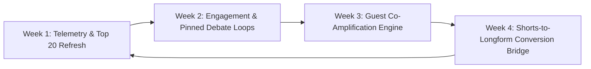

# 📺 YouTube Video Optimization & Growth Dashboard

> **Channel:** Breaking Into Cybersecurity ([@BreakingIntoCybersecurity](https://www.youtube.com/@BreakingIntoCybersecurity)) & CPF Coaching Ecosystem  
> **Status:** Live YouTube Analytics verified | Weekly telemetry: 2026-09-12 – 2026-09-18  
> **Interactive View:** [YOUTUBE_OPTIMIZATION_DASHBOARD.html](file:///Volumes/Crucial%20X9%20Pro%20For%20Mac/GDriveSync/Antigravity/YOUTUBE_OPTIMIZATION_DASHBOARD.html)

---

## 📊 Executive Overview & Net Results

| Pillar / Initiative | Scope & Volume | Execution Status | Net Impact & Results |
| :--- | :--- | :--- | :--- |
| **Channel Telemetry** | **2,030 Subscribers \| 72,606 Lifetime Views** | **Live Data** | 1,149 channel videos. |
| **Weekly Telemetry Loop** | **2026-09-12 – 2026-09-18** | **Live API** | **76 Views**, **00:27:00 Watch Time**, **00:00:43 Avg**, **+1 Net Subscribers**, **62 active videos**. |
| **Catalog Coverage** | **1,149 Channel Videos** | **Live Data** | Current YouTube channel video count. |
| **CPF Coaching CTA Rollout** | **944 Videos Updated** (215 already had CTA) | **100% Coverage** | Every single video description now funnels viewers directly to the CPF Coaching Security Snapshot (`calendarbridge.com/book/cpf-coaching/`) and vCISO Substack. |
| **SEO & Chaptering Pipeline** | **YouTubeSEOMaximizer** | **Active** | Automated generation of keyword-rich titles, structured descriptions, guest tags, and precise `[MM:SS]` chapter markers. |

---

## 📡 Weekly Telemetry Snapshot (2026-09-12 – 2026-09-18)

### 📊 Scorecard Metrics (7-Day Period)

| Metric | Weekly Value | Status / Diagnostic | Strategic Context |
| :--- | :---: | :---: | :--- |
| **Total Views** | **76** | Live API | Across **62 active videos** out of 1,149 channel videos. |
| **Total Watch Time** | **00:27:00** | Live API | 27 total minutes watched. |
| **Average Watch Duration** | **00:00:43** | Live API | 43 seconds per view. |
| **Subscriptions** | **+1 Net** (2 Added, 1 Removed) | Live API | Previous seven complete days. |
| **Likes & Dislikes** | **+0 Net** (0 Likes, 0 Dislikes) | Live API | Previous seven complete days. |
| **User & Video Comments** | **0** | Live API | Previous seven complete days. |
| **Video Shares** | **0** | Live API | Previous seven complete days. |
| **Geographic Reach** | **Not queried** | Not evaluated | This run does not infer geography without a dedicated API query. |

---

### 🎬 Top Weekly Videos (1–10 of 62 Active Videos)

| Rank | Video | Views | Avg Watch Time | Shares |
| :---: | :--- | :---: | :---: | :---: |
| 1 | **AI + Cyber Mentorship Guide \| CPF Coaching LLC** (`ucU61U_IQ0w`) | 7 | 00:01:53 | 0 |
| 2 | **CISO Tradecraft - Guest: Christophe Foulon \| CPF Coaching LLC** (`Jg_0laZpQWE`) | 4 | 00:00:03 | 0 |
| 3 | **Leaving Stability for Cyber AI: Zaun.ai's Story \| CPF Coaching LLC** (`jGI5pbwuNO4`) | 4 | 00:00:11 | 0 |
| 4 | **We're hacking resumes LIVE! w/ Naomi Buckwalter + Dr.... \| CPF Coaching LLC** (`PTJQumxFvew`) | 3 | 00:00:00 | 0 |
| 5 | **SOC Interview Drill Guide \| CPF Coaching \| BIC** (`j5DPnaWebQo`) | 3 | 00:00:00 | 0 |
| 6 | **Zaun.ai's AI Secret: Conviction & Innovation! \| CPF Coaching LLC** (`gvfcHDRAHwA`) | 3 | 00:00:24 | 0 |
| 7 | **The 4 Cs of Effective Leadership: Insights Mattis &... \| CPF Coaching LLC** (`Vh5pj1k8G30`) | 2 | 00:00:21 | 0 |
| 8 | **Charles Karanja: Community Interest \| CPF Coaching LLC** (`8MVJjYEYqU4`) | 2 | 00:00:00 | 0 |
| 9 | **Are Cybersecurity Certifications Still Worth It? \| Jason Dion Interview** (`41Uon-hZXFU`) | 2 | 00:00:19 | 0 |
| 10 | **Building the Cybersecurity Workforce: Eric Stride's... \| CPF Coaching LLC** (`IZozmrJrid0`) | 2 | 00:00:08 | 0 |

---

### 🔍 Current Telemetry Findings

1. **Top weekly video:** AI + Cyber Mentorship Guide | CPF Coaching LLC led with 7 views and 00:01:53 average watch time.
2. **Audience depth:** Average view duration was 00:00:43 across 76 views.
3. **Engagement:** 0 likes, 0 comments, and 0 shares were recorded in the period.

---

## 🏆 Top 10 All-Time Highest Traffic & Conversion Assets

| Rank | Video ID | Views | Likes | Comments | Title / Focus |
| :---: | :--- | :---: | :---: | :---: | :--- |
| 1 | `NQYoLbPlrr0` | 1,472 | 31 | 0 | **Blackhat 2023 Advice II** — Breaking into Cybersecurity |
| 2 | `2qdKVYFGQps` | 1,228 | 3 | 0 | **Unlocking the Secrets of Effective Hiring in a Noisy Market** |
| 3 | `lCX3jNhSTqY` | 1,211 | 5 | 0 | **Creating a Supportive Work Environment in Cybersecurity** |
| 4 | `NP4HlDYYRsc` | 1,202 | 0 | 0 | **The Exciting Challenge of AI in Cybersecurity** |
| 5 | `P1Or_C-3Gx8` | 1,151 | 0 | 0 | **Limitations into Superpowers Leadership** — CISO Tradecraft |
| 6 | `luvEoAt27-I` | 1,105 | 2 | 0 | **The Rapid Evolution of Cyber Attacks You Must Know** |
| 7 | `jXwo5gv7tGw` | 812 | 0 | 0 | **Trusting AI: The Gray Area of Security Best Practices** |
| 8 | `l7JROWkWO7U` | 746 | 21 | 1 | **Breaking Into Cybersecurity** — Charles Karanja |
| 9 | `T6tQjO5fUdQ` | 684 | 11 | 0 | **Unlocking Job Opportunities: Creative Ways to Beat the ATS** |
| 10 | `41Uon-hZXFU` | 633 | 19 | 1 | **Breaking into Cybersecurity** — Jason Dion |

---

## 🎯 Key Performance Metrics Audit

### 1. New Subscribers (Discovery & Conversion)

* **What Has Been Done:**
  * Keyword and search-intent optimization across titles and tags targeting high-volume beginner and career-transition terms (e.g., *"breaking into cybersecurity"*, *"cybersecurity career pivot"*, *"non-tech path"*).
  * 1,159 video descriptions unified with clear brand authority and host identity (Christophe Foulon).
* **Current Bottleneck:** Long-form episodes (45–60 mins) require high initial investment before a viewer decides to subscribe. Without dedicated short-form discovery clips, new viewer acquisition relies purely on search and algorithm browse features.
* **WoW Incremental Improvement Lever:**
  * **Shorts Funnel:** Systematically extract 30–60s "Gold Nugget" vertical clips from podcast episodes and publish 3–5 Shorts weekly with direct links back to full episodes.
  * **Value-Gap Pinned Comments:** Pin a value-first comment on every video with an explicit reason to subscribe (e.g., *"Subscribe for weekly vCISO breakdowns and direct career roadmaps"*).

---

### 2. Watch-Through Rates & Retention (AVD)

* **What Has Been Done:**
  * Automated generation of timestamped chapter markers (`[00:00]` Introductions, key question transitions, takeaways).
  * Chaptering allows viewers to jump directly to the specific insights they need, reducing bounce rate from frustrated skipping.
* **Current Bottleneck:** 45–60 minute technical interviews naturally suffer from audience drop-off in the first 3–5 minutes if the opening doesn't immediately hook the viewer.
* **WoW Incremental Improvement Lever:**
  * **15-Second Teaser Hooks:** Place the guest's most punchy statement in the first 15 seconds before the show intro stinger.
  * **Topical Pacing:** Use visual cues/cards at minute 5, 15, and 30 to preview upcoming insights (e.g., *"Coming up at 18:30: Why most entry-level certs fail"*).

---

### 3. Engagement (Comments, Likes & Community)

* **What Has Been Done:**
  * Community post templates and guest amplification copy created in `bic-skills`.
  * Standardized call-to-action blocks appended across all channel video descriptions.
* **Current Bottleneck:** Most viewers consume podcasts passively. Without an active debate prompt in the video and comment section, viewers rarely leave comments.
* **WoW Incremental Improvement Lever:**
  * **Open-Ended Debate Pins:** In the #1 pinned comment, pose a controversial or thought-provoking question (e.g., *"What's your biggest hurdle breaking into infosec right now? Let's discuss below."*).
  * **First 2-Hour Golden Window:** Respond to 100% of viewer comments within the first 120 minutes of upload to trigger YouTube's algorithmic velocity signal.

---

### 4. Sharing & Off-Platform Distribution

* **What Has Been Done:**
  * Multi-platform syndication workflows connecting YouTube uploads to LinkedIn, Substack, and Twitter.
  * 944 back-catalog videos updated with seamless cross-links to Substack and Coaching snapshot calls.
* **Current Bottleneck:** Guests frequently do not share their own episodes if they are only given a raw YouTube URL.
* **WoW Incremental Improvement Lever:**
  * **Guest Co-Promotion Kit:** Deliver a 1-click social kit to every guest on launch day containing:
    1. A customized 9:16 vertical video snippet.
    2. Pre-written LinkedIn post copy tagging their profile and breaking down their top quote.
    3. Direct links to both the YouTube video and CPF Coaching ecosystem.

---

## 📈 Week-Over-Week (WoW) Incremental Improvement Cadence

### 🗓️ Weekly Execution Plan

1. **Week 1: Telemetry & Top 20 Crown Jewels Audit**
   * Authenticate `youtubeAnalytics.readonly` in `metrics_tracker.py` to establish automated weekly metric baselines.
   * Identify the Top 20 highest-viewed episodes and refresh their thumbnails using high-contrast visual templates to boost Click-Through Rate (CTR).
2. **Week 2: Engagement & Interactive Discussion Loops**
   * Roll out pinned conversation starters across recent uploads.
   * Post 2 weekly YouTube Community polls/questions linking back to high-performing catalog episodes.
3. **Week 3: Guest Amplification Automation**
   * Standardize the guest handoff workflow in Notion so every guest receives social-ready video cuts within 24 hours of publish.
4. **Week 4: Shorts & Splicing Machine**
   * Run `extract_ai_clips` on the last 4 podcast releases to generate 12 vertical Shorts scheduled across the month.

---

## 🚀 Immediate Next Actions

1. **Activate Daily Analytics Ingestion:** Connect the Google Cloud OAuth credentials to `metrics_tracker.py` for automated weekly reporting.
2. **Launch 3 Shorts/Week Cadence:** Utilize existing transcript-to-clip workflows in `YouTubeSEOMaximizer` to feed YouTube Shorts.
3. **Deploy Pinned Engagement Strategy:** Add high-conversion pinned comments to the top 10 traffic-driving videos.

<!-- LAST_SATURDAY_SYNC: 2026-09-19 08:43:59 -->
